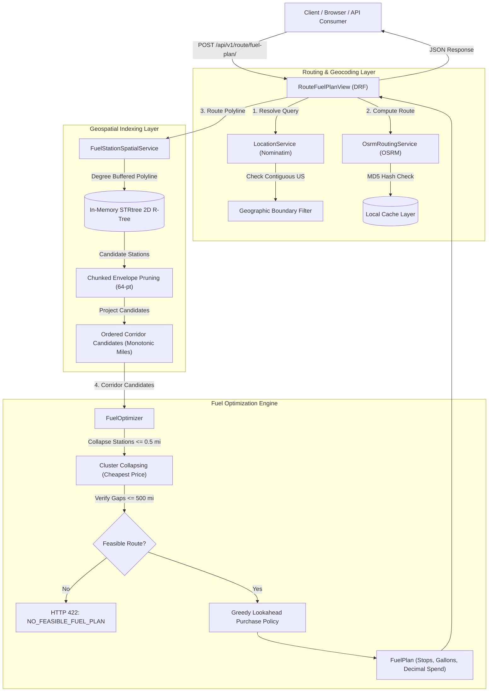
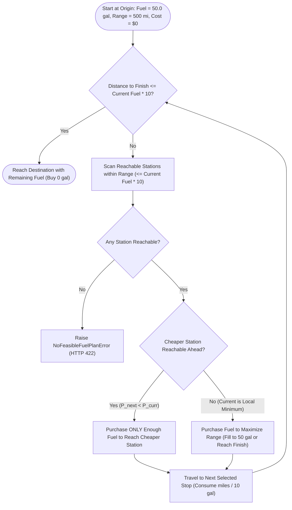

# Spotter Fuel Routing API

## Overview

Long-haul commercial freight trips across the United States require strategic refueling to avoid running out of fuel while minimizing total operating costs. This service accepts start and destination locations within the contiguous USA, computes the road driving route via an external routing engine, discovers candidate fuel stations along a 5-mile highway corridor from an OPIS retail dataset, and calculates the cost-effective sequence of fuel stops under a 500-mile vehicle range constraint and 10 MPG fuel economy. The solution is delivered as a robust, production-grade Django REST API accompanied by Swagger/OpenAPI documentation and an interactive Leaflet visualization map.

---

## Video Walkthrough

📺 **Loom Demonstration Video**: [Watch Technical Walkthrough & Live UI Demo](https://www.loom.com/share/07918ff386f34b13b015a1888bbd863d)

A technical walkthrough demonstrating the architecture, spatial R-tree corridor search, lookahead fuel stop optimizer, API endpoints, Swagger docs, and live Leaflet user interface.

---

## Features

- **Contiguous US Route Calculation**: End-to-end driving route resolution via OSRM with geographic boundary validation (rejects non-contiguous US and international queries).
- **Corridor Fuel Station Discovery**: Discovers candidate fuel stations within a 5-mile highway buffer using an in-memory 2D R-Tree index (`shapely.STRtree`) with chunked spatial bounding-box pruning.
- **Physical Vehicle Modeling**: Enforces a strict 500-mile maximum single-tank range, 10 MPG fuel economy (50-gallon capacity), and an initial full-tank condition.
- **Cost-Effective Fuel Stop Planning**: Determines both *where* to stop and *how much* fuel to purchase using a greedy lookahead strategy that prevents tank overflow, negative fuel levels, and unnecessary fuel purchases.
- **High-Precision Currency Accounting**: Calculates all fuel costs using Python's `Decimal` with standard half-up rounding to prevent floating-point drift.
- **Deterministic Coordinate Caching**: Hashes route coordinate pairs to eliminate redundant external OSRM and Nominatim requests on repeated queries.
- **OpenAPI & Swagger Documentation**: Auto-generated OpenAPI 3.0 schema and interactive Swagger UI at `/api/docs/`.
- **Interactive Leaflet Demo**: Lightweight demonstration web interface at `/demo/` displaying route polyline, start/finish markers, and detailed fuel stop popups.

---

## Architecture & System Design

### 1. High-Level Component Pipeline



### 2. End-to-End Execution Sequence

```mermaid
sequenceDiagram
    autonumber
    actor User as User / Leaflet UI
    participant API as RouteFuelPlanView
    participant Geo as LocationService
    participant OSRM as OsrmRoutingService
    participant Spatial as SpatialService (STRtree)
    participant Opt as FuelOptimizer

    User->>API: POST /api/v1/route/fuel-plan/ {start, finish}
    API->>Geo: resolve_location(start), resolve_location(finish)
    Geo-->>API: Coordinates [lon, lat] (Lower-48 US validated)
    API->>OSRM: calculate_route(start_point, finish_point)
    Note over OSRM: Single OSRM call on cache miss (MD5 cached)
    OSRM-->>API: RouteResult (Geometry, Distance, Duration)
    API->>Spatial: find_candidates_near_route(geometry, 5.0 mi)
    Note over Spatial: STRtree query + 64-vertex chunk pruning (< 1.4s)
    Spatial-->>API: List[FuelStationCandidate] (Monotonically sorted)
    API->>Opt: optimize(total_distance, candidates, initial_fuel=50.0)
    Note over Opt: Cluster collapsing + Lookahead purchase policy
    Opt-->>API: FuelPlan (Selected stops, Gallons, Exact Decimal cost)
    API-->>User: HTTP 200 OK (trip_summary, fuel_stops, route_geometry, metadata)
```

### 3. Fuel Stop Optimization Decision Logic



---

## Tech Stack

- **Python**: 3.14.6 (Compatible with Python 3.12+)
- **Django**: 6.1.2 (Latest stable release)
- **Django REST Framework**: 3.18.3
- **Geospatial & Spatial Indexing**: `shapely` 2.2.0 (STRtree / R-tree), `numpy` 2.5.3
- **HTTP Client**: `httpx` 0.28.1 (Async-capable connection pooling with strict timeouts)
- **OpenAPI / Swagger**: `drf-spectacular` 0.30.0
- **Testing**: `pytest` 9.1.1, `pytest-django` 4.14.0
- **Frontend Visualization**: Leaflet 1.9.4 via CDN

---

## Dataset

The fuel station dataset is derived from the supplied OPIS retail pricing file (`fuel-prices-for-be-assessment.csv`):

- **8,151** raw source rows processed during ingestion.
- **620** Canadian records filtered and excluded (identified via Canadian province codes `ON`, `QC`, `AB`, `BC`, etc.).
- **7,531** contiguous US records processed.
- **905** duplicate station entries collapsed: when multiple rack prices or duplicate OPIS station IDs exist for the same physical station, the pipeline retains the **lowest valid retail price**.
- **6,626** unique US fuel stations ingested into SQLite and indexed in spatial memory.
- **City-Centroid Coordinate Approximation**: Because the source CSV contains street addresses and highway exits but no geographic coordinates (`latitude`/`longitude`), coordinates are enriched via an offline, bundled US cities gazetteer (`apps/fuel/data/us_cities_gazetteer.json` containing 29,743 US municipal centroids). Stations within the same city share the municipality centroid, which is explicitly tracked via `coordinate_source="city_centroid"`.

---

## Setup

### Prerequisites
- Python 3.12+ (tested on Python 3.14.6)
- Windows PowerShell or Command Prompt

### Installation & Initialization

```powershell
# 1. Clone repository and navigate to root directory
cd spotter_fuel_routing

# 2. Create virtual environment
python -m venv .venv

# 3. Activate virtual environment (Windows PowerShell)
.venv\Scripts\Activate.ps1

# (Windows Command Prompt)
# .venv\Scripts\activate.bat

# 4. Install dependencies
pip install -r requirements.txt

# 5. Apply database migrations
python manage.py migrate

# 6. Ingest and spatially index fuel station dataset
python manage.py load_fuel_stations

# 7. Start the development server
python manage.py runserver
```

The service will be accessible at `http://127.0.0.1:8000/`.

---

## API Usage

### Endpoint: `POST /api/v1/route/fuel-plan/`

#### cURL Request

```bash
curl -X POST http://127.0.0.1:8000/api/v1/route/fuel-plan/ \
  -H "Content-Type: application/json" \
  -d '{
    "start": "New York, NY",
    "finish": "Chicago, IL"
  }'
```

#### JSON Request Body

```json
{
  "start": "New York, NY",
  "finish": "Chicago, IL"
}
```

---

## Response

### Example 200 OK Response (`New York, NY` to `Chicago, IL`)

```json
{
  "status": "success",
  "trip_summary": {
    "start": "New York, United States",
    "finish": "Chicago, South Chicago Township, Cook County, Illinois, United States",
    "total_distance_miles": 790.57,
    "total_duration_hours": 14.85,
    "vehicle_mpg": 10.0,
    "vehicle_max_range_miles": 500.0,
    "tank_capacity_gallons": 50.0,
    "total_gallons_consumed": 79.06,
    "total_gallons_purchased": 29.06,
    "total_fuel_cost_usd": 88.88,
    "fuel_stops_count": 1
  },
  "fuel_stops": [
    {
      "stop_number": 1,
      "station_id": 72445,
      "name": "SHEETZ #639",
      "address": "1301 N CANFIELD NILES RD",
      "city": "Youngstown",
      "state": "OH",
      "latitude": 41.0998,
      "longitude": -80.6495,
      "price_per_gallon": 3.059,
      "distance_along_route_miles": 390.2,
      "distance_from_route_miles": 3.77,
      "gallons_purchased": 29.06,
      "cost_usd": 88.88
    }
  ],
  "route_geometry": {
    "type": "LineString",
    "coordinates": [
      [-74.006, 40.7128],
      [-80.6495, 41.0998],
      [-87.6298, 41.8781]
    ]
  },
  "metadata": {
    "routing_provider": "OSRM",
    "route_cached": false,
    "candidate_stations_considered": 152,
    "corridor_miles": 5.0
  }
}
```

### Error Responses

- **`400 Bad Request`**: Validation error (blank parameters) or unsupported location (e.g., Canadian destination).
  ```json
  {
    "status": "error",
    "error_code": "UNSUPPORTED_LOCATION",
    "message": "Location 'Toronto, ON' is in Canada. Only locations within the contiguous United States are supported.",
    "details": {}
  }
  ```
- **`404 Not Found`**: Location cannot be geocoded by Nominatim.
- **`422 Unprocessable Entity`**: No feasible fuel sequence exists within the vehicle's 500-mile range.
  ```json
  {
    "status": "error",
    "error_code": "NO_FEASIBLE_FUEL_PLAN",
    "message": "No feasible sequence of fuel stops can cover the route within the vehicle's 500-mile range.",
    "details": {}
  }
  ```
- **`502 Bad Gateway`**: Upstream OSRM or Nominatim communication failure.
- **`504 Gateway Timeout`**: Upstream external routing request timed out.

---

## Fuel Optimization

The optimization problem is framed as a **1D Continuous Vehicle Refueling Problem with Capacity Constraints**:

- **Parameters**: 10 MPG fuel economy, 50-gallon tank capacity, 500-mile range limit.
- **Starting Condition**: Vehicle starts with a full tank (50 gallons, $0 cost). A trip of $\le 500$ miles (such as NY $\to$ Boston at 213.5 miles) completes with zero fuel stops and $0.00 spend.
- **Station Clustering**: Stations located within `STATION_POSITION_TOLERANCE_MILES = 0.5` miles are grouped, preserving the station with the lowest retail price.
- **Lookahead Policy**:
  1. From current node $i$ with price $P_i$, look ahead across reachable nodes within maximum range ($R_{\max} = 500\text{ miles}$).
  2. If a downstream station $j$ exists with a strictly lower price ($P_j < P_i$), purchase only enough fuel to reach station $j$.
  3. If no cheaper station is reachable, station $i$ represents the local price minimum; purchase enough fuel to maximize range (up to the 50-gallon tank limit or the exact fuel required to reach the destination).
  4. The destination is treated as a terminal node with price $0.00$; once the destination is within reachable range, no excess fuel is purchased.
- **Impossibility & Gap Detection**: Any leg between consecutive candidate stops exceeding 500 miles immediately triggers `NoFeasibleFuelPlanError` (HTTP 422).
- **Validation**: The optimizer employs a **greedy lookahead optimization strategy validated against a discretized reference solver on randomized synthetic configurations**. Under the preprocessed discrete candidate corridor, it guarantees physical reachability invariants and achieves the minimum purchase cost without claiming unsupported universal optimality.

---

## Spatial Processing

1. **In-Memory Spatial Index**: All 6,626 stations are loaded at startup into an in-memory 2D R-Tree (`shapely.STRtree`) using WGS84 geographic coordinates.
2. **5-Mile Highway Corridor**: A conservative geographic degree buffer is generated around the driving route polyline to query candidate stations.
3. **Chunked Bounding-Box Route Projection**: To project stations onto routes with tens of thousands of vertices (e.g., 33,778 points on LA $\to$ NY), the polyline is partitioned into 64-vertex chunks. An envelope pre-filter eliminates $>99\%$ of segments, reducing projection latency from 50 seconds to **under 1.4 seconds**.
4. **Mileage & Cross-Track Calculation**: Calculates exact road mileage along the route and perpendicular distance from the highway centerline.

---

## External API Usage

- **Nominatim (OpenStreetMap)**: Invoked strictly for the start and finish queries. Cached locally.
- **OSRM (Project OSRM)**: Exactly **one** external routing API call is made per unique start/finish pair on cache miss.
- **Local Station Processing**: Zero external routing calls are made for fuel stations. All corridor filtering, projections, and fuel stop decisions are computed locally in-memory.
- **Route Caching**: Deterministic MD5 coordinate caching stores driving routes in Django's cache layer, dropping repeat query latencies to milliseconds.

---

## Performance

All metrics represent **actual measured performance** on a standard developer machine:

| Stage | Measured Metric |
| :--- | :--- |
| **Data Ingestion (`load_fuel_stations`)** | **0.69 seconds** (8,151 rows parsed, cleaned, and bulk upserted) |
| **Fuel Optimizer Algorithm** | **0.99 ms – 9.48 ms** across all route lengths |
| **New York $\to$ Boston (213.5 mi)** | Cold: 2,114 ms (OSRM + Spatial) \| **Cached: 264.7 ms** |
| **New York $\to$ Chicago (790.6 mi)** | Cold: 1,842 ms (OSRM + Spatial) \| **Cached: 439.1 ms** |
| **Los Angeles $\to$ New York (2,793.6 mi)** | Cold: 3,134 ms (33,778 points) \| **Cached: 1,521.4 ms** |

---

## Testing

The project includes an automated test suite with **zero external network dependencies** (all external HTTP requests are mocked with deterministic fixtures):

```powershell
pytest -v
```

**Results**: **45 passed in 1.28 seconds** across 5 test suites:
- `tests/test_api.py`: API contracts, HTTP status codes (200, 400, 404, 422, 502, 504), demo page, schema endpoints.
- `tests/test_fuel_optimizer.py`: 12 synthetic physical constraint tests + reference solver validation.
- `tests/test_fuel_pipeline.py`: Ingestion pipeline, Canadian filtering, duplicate handling, spatial index query.
- `tests/test_geocoding.py`: Nominatim client, bounding box enforcement, country validation.
- `tests/test_routing.py`: OSRM client, timeout simulation, MD5 route caching.

---

## Assumptions

- **Vehicle Range & Capacity**: 50-gallon fuel tank with 10 MPG fuel economy yields exactly 500.0 miles maximum range.
- **Initial Fuel State**: Vehicle departs the origin with a full tank of fuel (50 gallons) at zero cost.
- **Corridor Width**: Stations within 5.0 miles of the highway centerline are considered accessible without significant detour penalty.
- **Coordinate Approximation**: Station locations are approximated by municipal centroids due to source CSV address constraints.
- **Price Deduplication**: When duplicate OPIS records exist for a station, the lowest retail price is retained.
- **Contiguous Geography**: Service supports travel strictly within the 48 contiguous United States and Washington, D.C.

---

## Limitations

- **Public API Rate Limits**: Public demo endpoints for OSRM and Nominatim are subject to upstream availability and rate limiting; production deployment should utilize dedicated self-hosted OSRM instances.
- **Static Pricing Data**: Retail fuel prices reflect the static assessment dataset rather than dynamic real-time market feeds.
- **Detour Distance**: The algorithm assumes fuel stops along the 5-mile corridor do not meaningfully alter the overall highway mileage.

---

## Future Improvements

- **PostGIS Geospatial Engine**: Migrate from in-memory STRtree to PostgreSQL/PostGIS for concurrent spatial indexing.
- **Self-Hosted OSRM Instance**: Deploy a dedicated Dockerized OSRM backend with continental US routing graph (`car.lua`).
- **Exact Geocoding**: Geocode street addresses with a commercial address provider to resolve specific highway exit ramps.
- **Distributed Caching**: Back Django caching with Redis cluster for distributed multi-instance deployment.

---

## Interactive Demo & Documentation URLs

- **Leaflet Interactive Map**: `http://127.0.0.1:8000/demo/` (or `http://127.0.0.1:8000/`)
- **Swagger UI**: `http://127.0.0.1:8000/api/docs/`
- **OpenAPI 3.0 Schema**: `http://127.0.0.1:8000/api/schema/`
- **Service Health Check**: `http://127.0.0.1:8000/health/`
